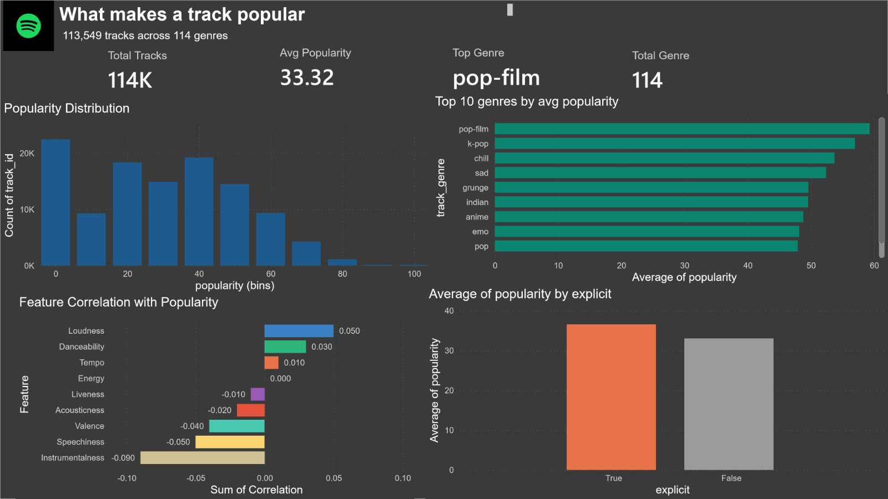

# 🎵 What Makes a Track Popular? — Spotify EDA & Power BI Dashboard

An end-to-end data analysis project exploring what drives song popularity across **113,549 tracks** and **114 genres** on Spotify, combining exploratory data analysis in Python with an interactive Power BI dashboard.

---

## 📌 Project Overview

This project investigates the relationship between audio features (loudness, danceability, energy, etc.), genre, explicit content, and track popularity using the Spotify Tracks Dataset. It's the first in a 3-part portfolio series (EDA → Funnel Analysis → Full-Stack App).

**Goal:** Identify measurable patterns behind what makes a track popular, and present findings through both a technical notebook and a business-facing interactive dashboard.

---

## 🔍 Key Insights

- **Popularity is heavily right-skewed** — the majority of tracks cluster in the 0–10 and 30–50 popularity range, with very few tracks scoring above 70, reflecting the reality that only a small fraction of music achieves mainstream popularity.
- **Genre matters more than expected** — *Pop-film* leads as the single highest average-popularity genre, followed closely by K-pop, Chill, and Sad, all clustering in the same competitive range — suggesting mood- and media-linked genres consistently outperform niche or purely instrumental genres.
- **Explicit content correlates with higher popularity** — tracks marked explicit show a noticeably higher average popularity than non-explicit tracks, hinting at either audience preference or a correlation with genres (hip-hop, pop) that already skew popular.
- **Loudness is the strongest positive predictor** of popularity among audio features, while **Instrumentalness is the strongest negative predictor** — tracks that are quieter, more melodic, and vocal-forward tend to outperform heavily instrumental tracks.
- **Danceability also positively correlates with popularity**, reinforcing the idea that upbeat, rhythm-driven tracks have broader appeal — while Speechiness and Valence show mild negative correlation, suggesting overly speech-heavy or excessively "happy-sounding" tracks may underperform slightly.
- **114 genres were analyzed** in total, giving a broad, statistically meaningful view rather than a narrow genre-specific study.

---

## 🛠️ Tools & Tech Stack

| Stage | Tools Used |
|---|---|
| Data Cleaning & EDA | Python (Pandas, NumPy, Matplotlib/Seaborn), Jupyter Notebook |
| Dashboard & Visualization | Power BI Desktop (DAX measures, custom theming) |
| Dataset | [Spotify Tracks Dataset (Kaggle)](https://www.kaggle.com/) — 113,549 tracks, 114 genres |

---

## 📊 Dashboard Features

- **KPI Cards:** Total Tracks, Average Popularity, Genre Count, Top Genre (via DAX measure)
- **Popularity Distribution:** Binned histogram showing the spread of popularity scores
- **Top 10 Genres by Avg Popularity:** Ranked bar chart highlighting top-performing genres
- **Explicit vs Non-Explicit:** Comparative average popularity analysis
- **Feature Correlation with Popularity:** Custom correlation table (loudness, danceability, tempo, energy, liveness, acousticness, valence, speechiness, instrumentalness) since Power BI doesn't natively compute correlation
- Custom dark theme, color-coded visuals, and Spotify-inspired branding for a polished, presentation-ready look

---

## 📁 Repository Structure
